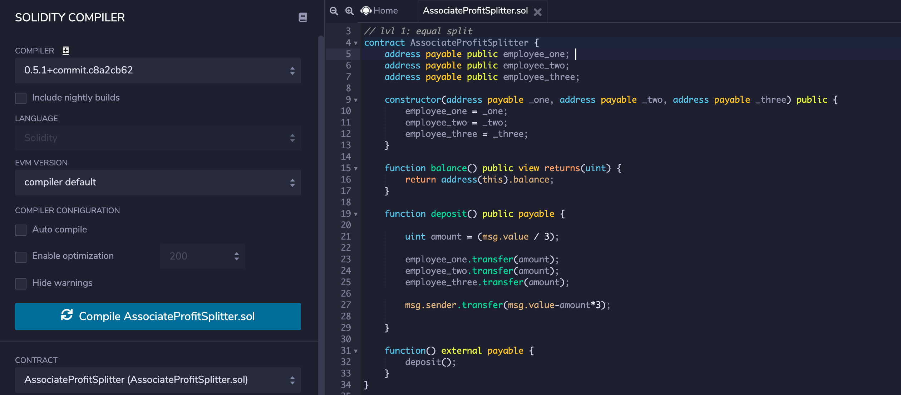
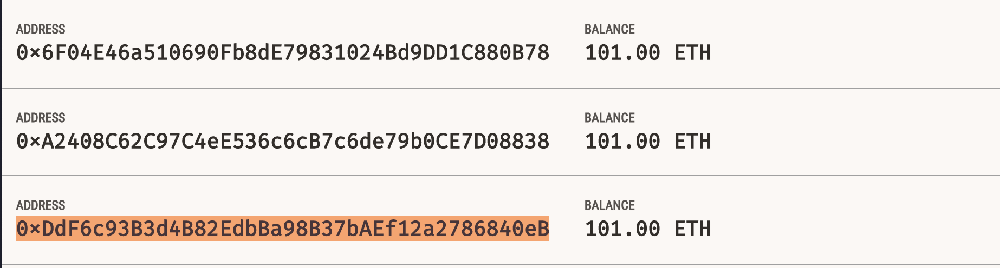
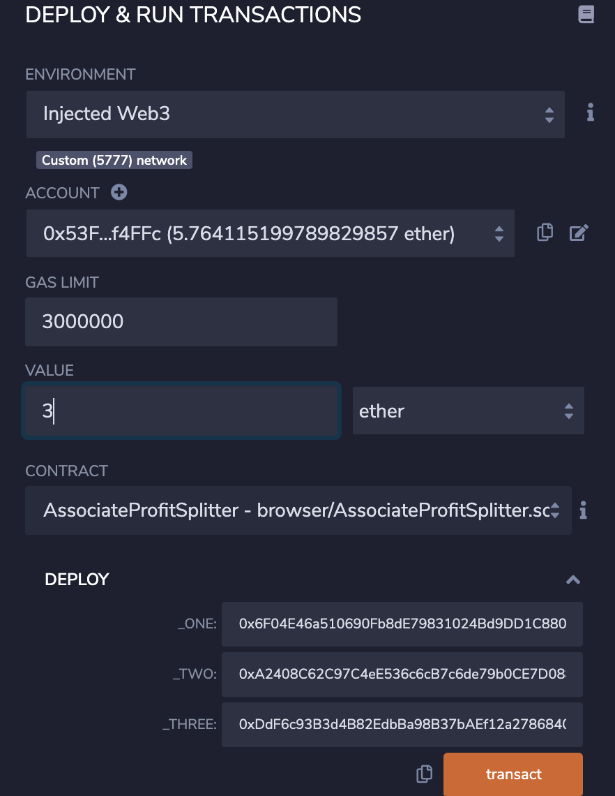
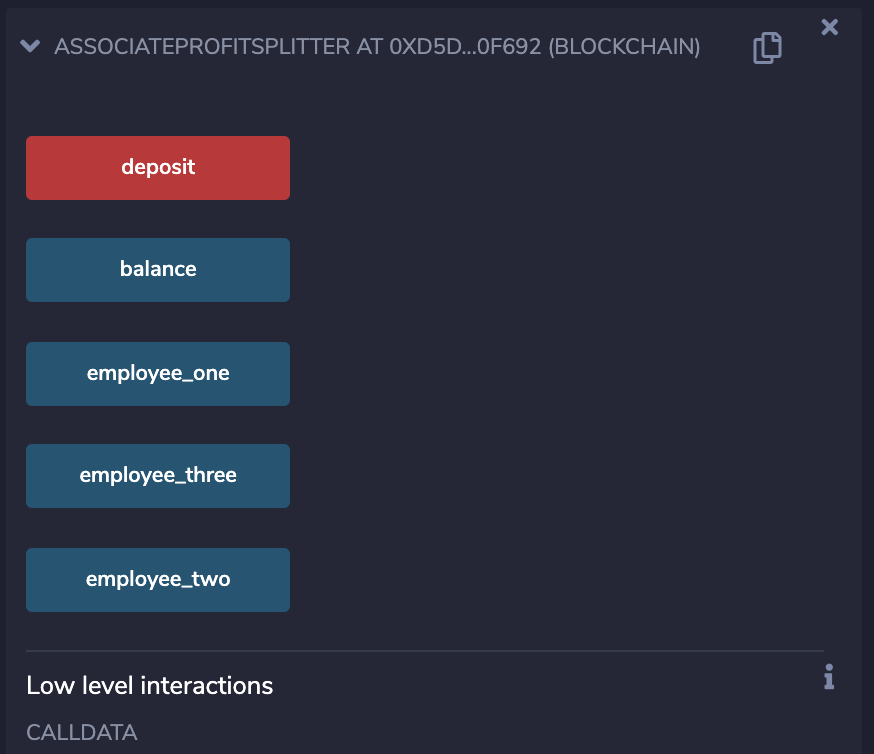
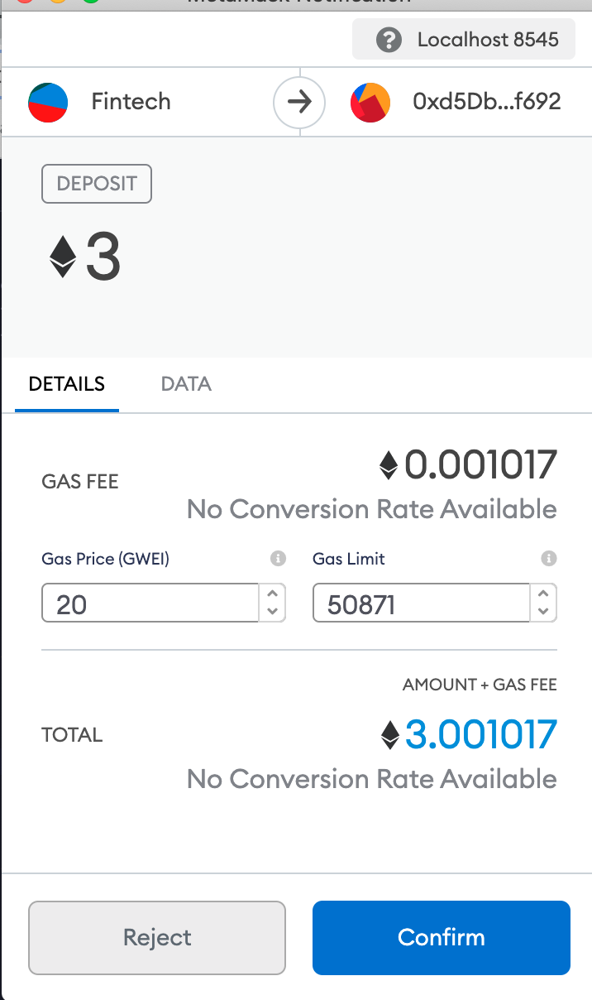
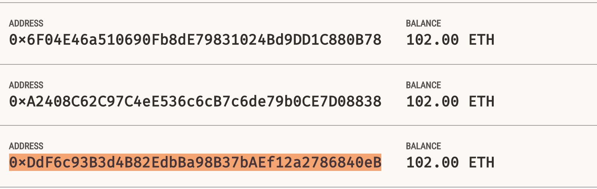

# Profit Splitter


### View attached starter code for compiled Solidity code.

* This is an `AssociateProfitSplitter` contract. This will accept Ether into the contract and divide the Ether evenly among the associate level employees. This will allow the Human Resources department to pay employees quickly and efficiently.

### Step 1:
* Write and Complie `AssociateProfitSplitter` code then move to deployment.


### Step 2:
* Ensure your `Ganache` is running and you have connected `MetaMask` showing your primary account connected with your `Remix IDE`.

* Ensure your environment is set to `Injected Web3` 

* Ensure the connected contract is `AssociateProfitSplitter.sol`

* ```Deploy``` with the 3 addresses you would like to set as your initialized "constructors". These are also your child addresses or employee_one/employee_two/employee_three addresses that we will be splitting the funds between. 

* Deposit funds to accounts 3 ways by inputting your desired `Value` of `ether` to send to the employees. 

# Check Account Balances Prior To Deposit

# Initialize Deployment to Addresses

# SET VALUE TO DEPOSIT THEN CLICK DEPOSIT

# Confirm Deposit In MetaMask

# Confirm Deposit In Ganache Ledger


